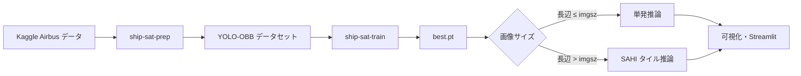
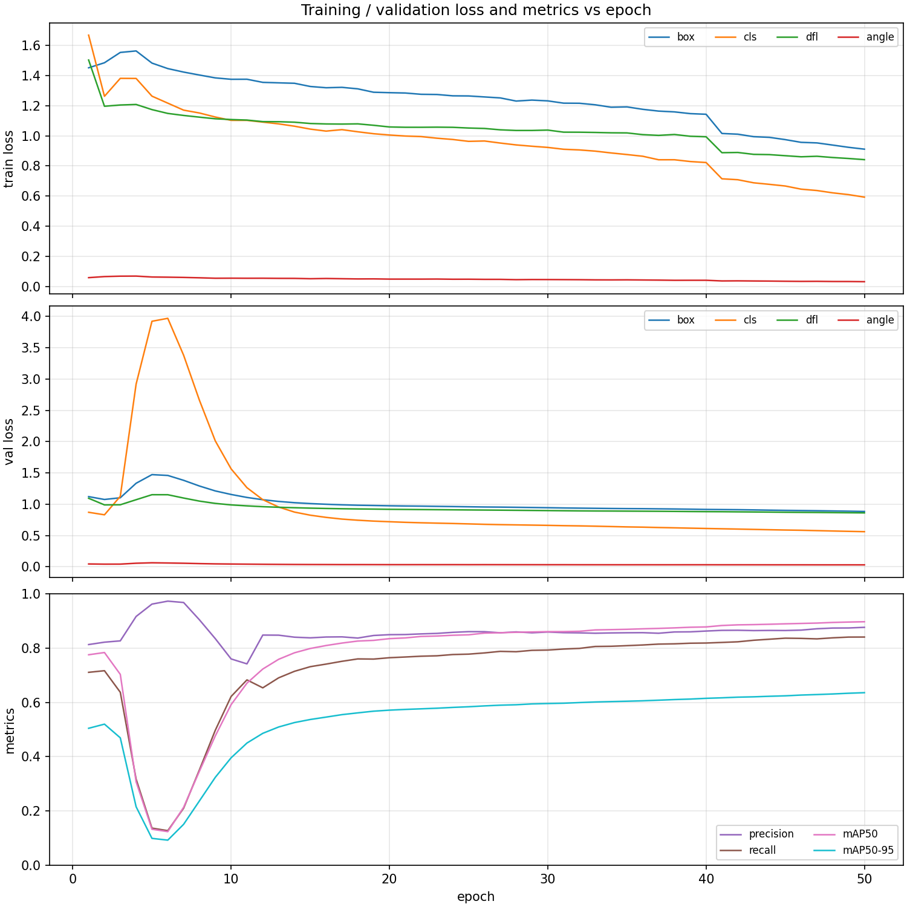
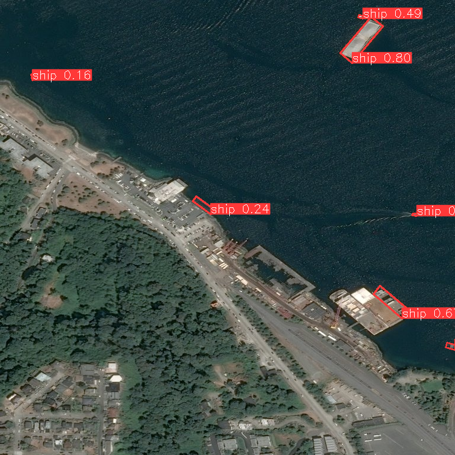

# 光学衛星画像における船舶検出（YOLO-OBB + SAHI）

[Kaggle Airbus Ship Detection](https://www.kaggle.com/c/airbus-ship-detection) の RLE マスク注釈から **YOLO 向きバウンディングボックス（OBB）** ラベルを生成し、**Ultralytics YOLO11n-OBB** で学習、**SAHI** によるタイル推論で大画像にも対応するパイプラインです。推論結果は **Streamlit** で信頼度付きに可視化できます。

## 概要

| 項目 | 内容 |
|------|------|
| タスク | 光学衛星画像上の船舶 **物体検出**（単一クラス `ship`） |
| 注釈形式（入力） | Airbus コンペの **RLE セグメンテーション** |
| 学習ラベル | **YOLO-OBB**（回転矩形） |
| 検出モデル | **YOLO11n-OBB**（[Ultralytics](https://github.com/ultralytics/ultralytics)） |
| 大画像推論 | **SAHI**（Slicing Aided Hyper Inference）でタイル分割推論 |
| UI | **Streamlit**（CPU 推論、信頼度表示） |



## データセットの取得方法

本リポジトリには **学習用の大容量画像・CSV は含めていません**（ライセンス・容量の都合）。利用者ご自身で Kaggle から取得してください。

### 1. Kaggle から手動ダウンロード（推奨）

1. [Airbus Ship Detection](https://www.kaggle.com/c/airbus-ship-detection) で **ルールに同意**し、データをダウンロードします。
2. zip を展開し、次のような構成で **`data/airbus_raw/`** に配置します。

```
data/airbus_raw/
├── train_ship_segmentations_v2.csv   # または train_ship_segmentations.csv
└── train_v2/                         # または train / train_images
    └── *.jpg
```

### 2. Kaggle API でダウンロード（任意）

1. Kaggle の Account から API Token（`kaggle.json`）を取得します。
2. 環境変数を設定します（**リポジトリにキーをコミットしないでください**）。

```bash
export KAGGLE_USERNAME="your_username"
export KAGGLE_KEY="your_api_key"
uv run ship-sat-download --output-dir data/airbus_raw
```

### 3. YOLO-OBB 形式への変換

```bash
uv run ship-sat-prep --output-root data/yolo_ship_obb
```

RLE マスクから輪郭を抽出し、最小外接矩形を **OBB ラベル**（正規化座標）として `data/yolo_ship_obb/` に出力します。`data.yaml` も自動生成されます。

> **データ利用について:** Airbus データセットの利用条件は Kaggle コンペの規約に従ってください。本コードの MIT ライセンスは **ソフトウェア** に適用され、データセット自体の再配布権は含みません。

## 物体検知モデル

### なぜ YOLO-OBB か

衛星画像上の船舶は **進行方向に沿った細長い形状** になることが多く、軸平行の矩形（AABB）より **回転矩形（OBB）** の方が背景を含みにくく、検出・重なりの扱いが有利です。

### 採用モデル

| 項目 | 設定 |
|------|------|
| バックエンド | [Ultralytics](https://docs.ultralytics.com/) |
| モデル | **YOLO11n-OBB**（`yolo11n-obb.pt` から学習） |
| 入力解像度 `imgsz` | **768**（`configs/default.yaml`） |
| クラス数 | 1（`ship`） |
| 損失 | `box` / `cls` / `dfl` / **`angle`**（OBB 用） |

学習例:

```bash
uv run ship-sat-train \
  --data data/yolo_ship_obb/data.yaml \
  --model yolo11n-obb.pt \
  --name airbus_ship_obb
```

出力重み: `runs/obb/<実験名>/weights/best.pt`

### 学習曲線（参考）

50 エポック学習の `results.csv` からプロットした例です（再現は `scripts/plot_training_curves.py`）。



- 序盤で val 損失・mAP が揺れる区間があり、その後 **mAP50 は約 0.90 前後** まで改善する傾向でした。
- 詳細な数値は手元の `runs/obb/<name>/results.csv` を参照してください。

### 推論結果の例



## 大画像時の推論方法（SAHI）

学習時は画像を **`imgsz`（既定 768）** にリサイズして学習しますが、実運用では **元解像度のまま、学習サイズより大きい画像** を扱うことがあります。その場合、1 枚をそのままモデルに入れると **船舶が極端に小さく** なり検出が落ちやすいため、**SAHI** でタイル分割推論を行います。

### 仕組み

1. 入力画像を **重なり付きのタイル**（既定 640×640、オーバーラップ 20%）に分割する。
2. 各タイルを YOLO-OBB で推論する。
3. 座標を **原画像座標系** に戻し、重複検出をマージする（SAHI / Ultralytics 連携）。
4. 可視化では各検出に **`ship 0.xx`** 形式で **信頼度** を表示する（`hide_conf=False`）。

### CLI

```bash
uv run ship-sat-infer \
  --weights runs/obb/airbus_ship_obb/weights/best.pt \
  --source path/to/large_image.jpg \
  --output runs/pred.png \
  --device cpu \
  --imgsz 768
```

大画像では **`--device` とタイル設定** のまま SAHI が使われます（`configs/default.yaml` の `sahi` セクション）。

### Streamlit での自動切替

`streamlit_app.py`（および `demo/` 配下の CPU 版）では:

- 画像の **長辺 > 学習 `imgsz`** → **SAHI タイル推論**
- それ以外 → **単発推論**

信頼度閾値・タイルサイズは UI から変更でき、変更後は **「設定で再推論」** で更新します。

## リポジトリ構成

```
.
├── README.md                 # 本ファイル
├── LICENSE
├── pyproject.toml
├── streamlit_app.py          # 学習済み重みを指定して推論する UI
├── configs/default.yaml      # imgsz / SAHI / 学習既定値
├── src/ship_sat/
│   ├── download.py           # Kaggle ダウンロード
│   ├── dataset_prep.py       # RLE → YOLO-OBB
│   ├── rle.py                # RLE デコード
│   ├── obb_labels.py         # マスク → OBB ラベル
│   ├── train.py              # Ultralytics 学習
│   └── infer_sahi.py         # SAHI 推論・可視化
├── scripts/plot_training_curves.py
├── tests/test_rle_obb.py
├── sample_images/            # デモ用サンプル（test 由来・10 枚）
├── docs/                     # 学習曲線・推論例
├── data/                     # 取得データの置き場（.gitkeep のみ同梱）
└── demo/                     # CPU のみのポータブル Streamlit デモ
```

## セットアップ

**前提:** Python 3.10+、[uv](https://docs.astral.sh/uv/)（または pip）

```bash
git clone <your-repo-url>
cd ship_detection_optical_images   # 本ディレクトリ名に合わせて変更
uv sync --all-extras
```

### GPU（学習・任意の GPU 推論）

| コマンド | 既定 | GPU を使う場合 |
|----------|------|----------------|
| `ship-sat-train` | `device: "0"` | `configs/default.yaml` または `--device 0` |
| `ship-sat-infer` | CPU | `--device cuda:0` |
| Streamlit（ルート） | 設定で `cpu` 可 | デバイス欄に `cuda:0` |

Jetson 等では PyPI の汎用 `torch` が CUDA と一致しないことがあるため、プラットフォーム向けビルドを利用してください。

## 使い方（クイックスタート）

```bash
# 1. データ配置（上記「データセットの取得」）
# 2. ラベル変換
uv run ship-sat-prep --output-root data/yolo_ship_obb

# 3. 学習
uv run ship-sat-train --data data/yolo_ship_obb/data.yaml --model yolo11n-obb.pt

# 4. 推論（大画像は SAHI）
uv run ship-sat-infer \
  --weights runs/obb/train/weights/best.pt \
  --source sample_images/0035268d9.jpg \
  --output runs/pred.png

# 5. Streamlit
export SHIP_OBB_WEIGHTS=runs/obb/train/weights/best.pt
uv run streamlit run streamlit_app.py
```

`sample_images/` に同梱した JPG で、学習後すぐに試せます。

## デモのみ（CPU / 別 PC）

学習済み `best.pt` を `demo/weights/best.pt` にコピーし、[demo/README.md](demo/README.md) の手順で Streamlit を起動できます。オフライン配布用に `demo/` だけを zip しても構いません。

## テスト

```bash
uv run pytest
```

## 公開時の注意（GitHub）

- **`*.pt` / `data/` 本体 / `runs/` / `.venv`** はコミットしないでください（`.gitignore` 済み）。
- 学習済み重みを配布する場合は **GitHub Releases** や外部ストレージを推奨します。
- Kaggle データを **リポジトリに含めない** でください。

## ライセンス

- **コード:** [MIT License](LICENSE)
- **データセット:** [Kaggle Airbus Ship Detection](https://www.kaggle.com/c/airbus-ship-detection) の利用規約に従うこと

## 参考文献・利用ライブラリ

- [Ultralytics YOLO](https://github.com/ultralytics/ultralytics)
- [SAHI](https://github.com/obss/sahi)
- [Airbus Ship Detection Challenge](https://www.kaggle.com/c/airbus-ship-detection)
